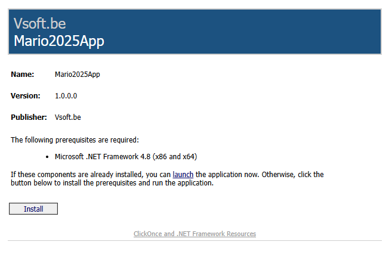
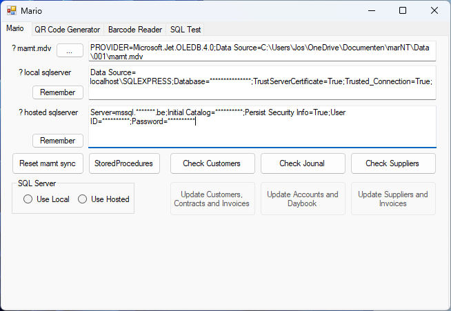

# Mario2025

## [ClickOnce][ClickOnce]



## History

Mario stands for M.A.R. Input Output Data transfer of our accounting data to different OS or Frameworks.

- It is a project started in 1987 for porting accounting data from systems created by Mallard BASIC B-Plus tree from CP/M to MS-DOS.
- Few years later when Windows 3.1 and Visual Basic 2.0 came around the corner in 1992, it did the transfer between Mallard Basic B-Plus tree data to NOVELL database.
- In 1995, I ported it to Windows 95 and Visual Basic 4.0 who also serves an indexing database called Jet Engine (Microsoft Access).
- These days, MarioApp is a .NET 8 application that can be used to export the Jet Engine database to a sqlserver database.
- Added functionality from 2025, support for Peppol exchange sending and receiving invoices, credit notes and orders.

## Ademico Peppol API Testing

In the MarioClasses folder for testing you need to add your secrets in an AdemicoSecrets.cs file like this:

```csharp
namespace MarioApp.MarioClasses
{
    internal class AdemicoSecrets
    {
        internal static readonly string ademicoUrl = "https://example.com"; // Replace with the actual URL
        internal static readonly string accessToken = "your-access-token"; // Replace with the actual access token
        internal static readonly string username = "your-username"; // Replace with the actual username
        internal static readonly string password = "your-password"; // Replace with the actual password
    }
}
```



[ClickOnce]: https://clickonce.vsoft.be/mario2025/publish.htm
